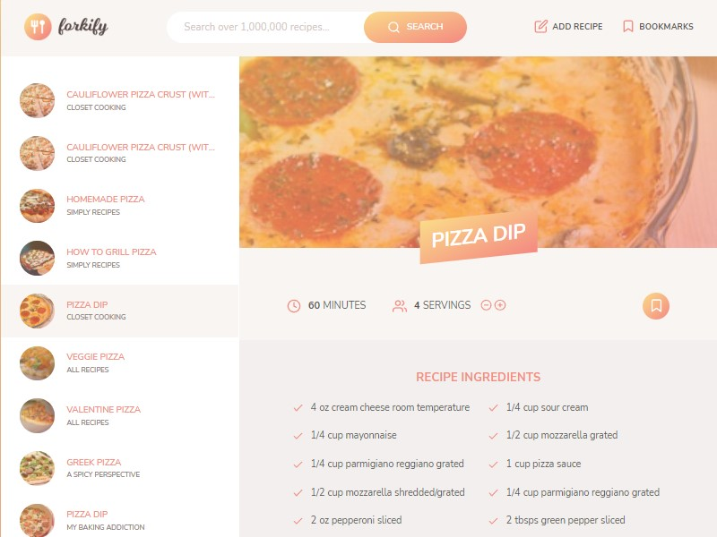

# Forkify



## About The Project

Forkify is a recipe search application build using
vanilla JavaScript and it uses Forkify API
to fetch and display recipe food recipes. This app uses modern
JavaScript tools, such as Webpack to bundle the
modules, and Babel for backward compatibility. This application
was built using MVC Software Architecture.The user can increase or decrease servings
as per his need and can view detailed directions.
Feature of adding favorite recipe as bookmark
via local storage is also implemented.

## Built Using

This app is built with vanilla JavaScript along with HTML and SCSS.
It uses webpack as module bundler and NPM as package manager

- JavaScript
- Webpack
- HTML
- SCSS
- NPM
- Software Architecture (MVC)

## Getting Started

To get started with project just simply fork this repo or download locally on your System.

To get a local copy up and running follow these simple example steps.

## Prerequisites

Start with the latest version of NPM to avoid any errors:

```bash
  npm install npm@latest -g
```

## Installation

Install my-project with npm

1). Get a free API Key at Forkify API_KEY

2). Clone the repo

```bash
 git clone https://github.com/KartikJS/ForkifyRecipeApp.git
```

3). Install NPM packages

```bash
 npm install
```

4). Enter your API in config.js

```bash
 const KEY = 'ENTER YOUR API';
```

## Usage

- The Forkify Recipe App allows users to search for recipes.
- Users can add their Recipes and send them to the API
- Users can view the recipe along with the cooking time and also increase or decrease the number of servings they need.
- Bookmarked recipes are stored in local storage so no database was required for this application.
